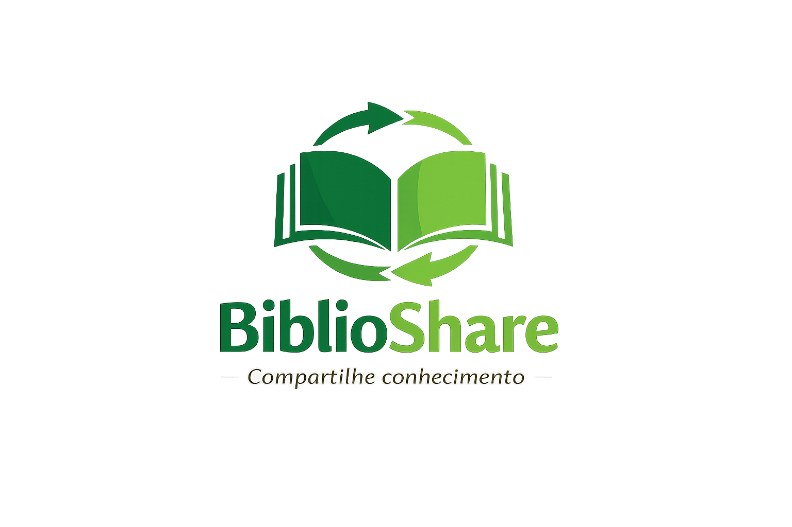

<p align="center">
  
</p>

<p align="center">
  Plataforma web para troca e empréstimo de livros 📚
</p>

---

<div align="center">

## 🌍 Sobre o projeto

O **BiblioShare** é uma plataforma web desenvolvida com o objetivo de incentivar o acesso à leitura por meio do **compartilhamento de livros entre usuários**, permitindo **trocas e empréstimos**, promovendo educação, sustentabilidade e reutilização de recursos.

Este projeto foi desenvolvido na disciplina de **Programação Web Front-End** do curso de **Engenharia de Software** da **Universidade Tecnológica Federal do Paraná (UTFPR)**.

</div>

---

## 🎯 Objetivo

O **BiblioShare** busca **promover o acesso democrático à leitura**, incentivando a reutilização de livros e fortalecendo a comunidade através do compartilhamento de conhecimento.

---

## 🌍 Objetivos de Desenvolvimento Sustentável

<div align="center">

<table>
<tr>

<td align="center" width="250">

<a href="https://brasil.un.org/pt-br/sdgs/4">
  
</a>

<br>

### ODS 4
**Educação de Qualidade**

Amplia o acesso à leitura e ao conhecimento.

</td>

<td align="center" width="250">

<a href="https://brasil.un.org/pt-br/sdgs/11">
  
</a>

<br>

### ODS 11
**Cidades e Comunidades Sustentáveis**

Incentiva colaboração e fortalecimento comunitário.

</td>

<td align="center" width="250">

<a href="https://brasil.un.org/pt-br/sdgs/12">
  
</a>

<br>

### ODS 12
**Consumo Responsável**

Estimula a reutilização de livros e reduz desperdícios.

</td>

</tr>
</table>

</div>

---

## 👩‍💻 Integrantes do Grupo 6

- [Maria Vitória Mendes Storel](https://github.com/m4riavit0ria)
- [Patrícia Lacerda Golfete](https://github.com/patriciagolfete)

---

## 💡 Funcionalidades

✔️ Cadastro de usuários  
✔️ Login no sistema  
✔️ Pesquisa de livros disponíveis  
✔️ Visualização de livros para troca e empréstimo  
✔️ Catálogo de livros adicionados recentemente  
✔️ Página individual de detalhes dos livros  
✔️ Navegação responsiva e intuitiva

---

## 🛠️ Tecnologias utilizadas

- HTML5  
- CSS3  
- JavaScript  
- Font Awesome (ícones)  
- Google Fonts

---

## 📁 Estrutura do projeto

```bash
BiblioShare/
│
├── index.html
├── livros.html
├── cadastro.html
├── login.html
│
├── html/
│   ├── livro-pequeno-principe.html
│   └── livro-dom-casmurro.html
│
├── css/
│   └── style.css
│
├── js/
│   └── script.js
│
├── img/
│   ├── logo-biblioshare.png
│   ├── pequeno-principe.jpg
│   ├── dom-casmurro.jpg
│   ├── ods4.png
│   ├── ods11.png
│   └── ods12.png
│
└── README.md
````

---

## 🚀 Como executar o projeto

### 1. Clone o repositório

```bash
git clone https://github.com/patriciagolfete/BiblioShare.git
```

### 2. Acesse a pasta do projeto

```bash
cd BiblioShare
```

### 3. Execute o projeto

Abra o arquivo `index.html` no navegador.

---

## 🌐 Projeto Online

Acesse pelo GitHub Pages:

**https://patriciagolfete.github.io/BiblioShare/**

---

## 🎥 Vídeo de Apresentação

Confira a apresentação em vídeo do projeto:
**[Assista aqui](https://youtu.be/_8w9WS-z3V4)**

---

## 📄 Licença

Projeto acadêmico desenvolvido para fins educacionais, sem fins lucrativos.

```
```
